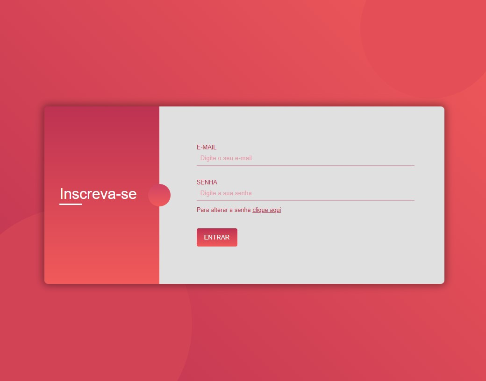
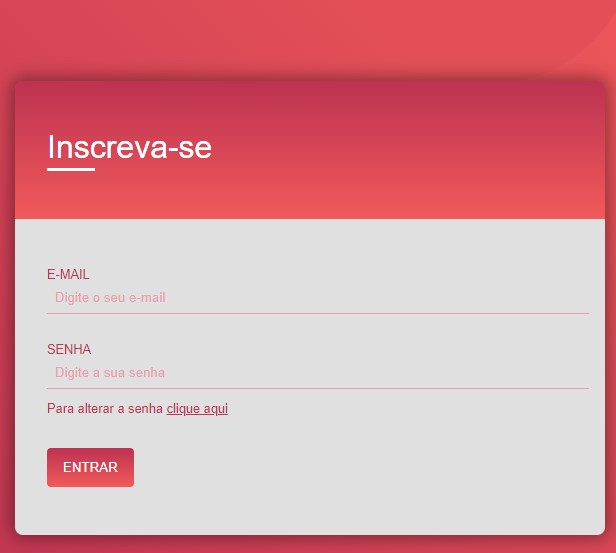

<h1 align="center">
    
    
</h1>

Login Page Responsive

<h4 align="center"> 
	- Status: ✅ -
</h4>

## ☑️ Sobre
---

Tela de login responsiva utilizando html e css.
Exercitando o uso de Flex, @media e gradiente na estilização do projeto.

### 🔌 Como rodar o projeto | Local
---
Caso queira rodar o projeto local, basta clonar e abrir o arquivo index.html no navegador.

### 🔋 Tecnologias
---
- [HTML]("")
- [CSS]("")

### 🎲 Feito por
---

<a href="https://github.com/juniorhbs">
 
  
 

 <b>Junior Oliveira</b></a> <a href="https://github.com/juniorhbs" >💻</a>

 

